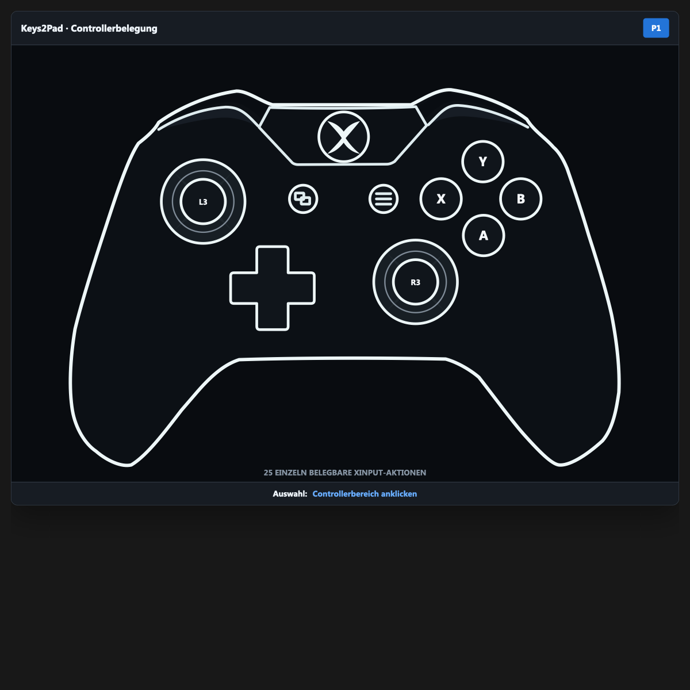

# Keys2Pad

**Turn keyboard keys into Xbox controllers on Windows.**

Keys2Pad is made for arcade cabinets, button boxes, regular keyboards and encoders such as the I-PAC. Map any key to up to four virtual Xbox 360 controllers. If real Xbox controllers are connected, they automatically take the first player slots and Keys2Pad fills the rest.

[](https://github.com/LilaQ/keys2pad/releases/tag/v0.4.0)
[](https://github.com/LilaQ/keys2pad/releases/tag/v0.4.0)



## Why it is useful

- map every button freely, including both sticks, L3/R3, D-pad, triggers and Guide;
- use any mix of real and virtual controllers across P1–P4;
- create profiles and switch them from the GUI, command line or LaunchBox;
- run quietly in the tray and optionally start with Windows;
- use the included AutoHotkey v1 and v2 scripts directly in LaunchBox;
- no accounts, telemetry, ads or app network traffic.

Example: with two real controllers connected, they become P1 and P2. Keys2Pad creates virtual P3 and P4. Windows ultimately assigns XInput indices, so games without hot-plug support should be started after the controllers are ready.

## Install

1. Install the official signed [ViGEmBus 1.22.0 release](https://github.com/nefarius/ViGEmBus/releases/tag/v1.22.0). The archived driver is required and is not installed silently by Keys2Pad.
2. Download and unpack the current [Keys2Pad prerelease](https://github.com/LilaQ/keys2pad/releases/tag/v0.4.0).
3. Start `Keys2Pad.exe`, click a controller control and press the keyboard key you want.
4. Check the result with `Win+R` → `joy.cpl`.

## Command line

```text
Keys2Pad.exe --start
Keys2Pad.exe --stop
Keys2Pad.exe --toggle
Keys2Pad.exe --status
Keys2Pad.exe --profile "Standard"
Keys2Pad.exe --show
Keys2Pad.exe --hide
Keys2Pad.exe --tray
Keys2Pad.exe --exit
```

LaunchBox examples are in [`LaunchBox/AHK-v2`](LaunchBox/AHK-v2) and [`LaunchBox/AHK-v1`](LaunchBox/AHK-v1).

## Build

On Windows with the .NET 8 SDK:

```powershell
./scripts/build.ps1
```

Builds and releases are produced locally; this repository does not use GitHub Actions or hosted runners.

## Notes

- Keyboard input is digital: sticks and triggers output 0 or 100 percent.
- ViGEmBus is archived and no longer maintained. Use only its official signed release and decide whether that dependency is appropriate for your machine.
- The current release is unsigned and marked as a prerelease.
- Privacy, third-party notices and unresolved release/compliance decisions are documented under [`docs`](docs).

Support and bug reports: [GitHub Issues](https://github.com/LilaQ/keys2pad/issues)

<!-- A real Buy me a beer button belongs here once the owner provides an approved payment URL. -->
